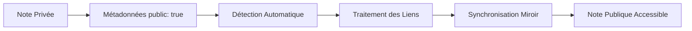
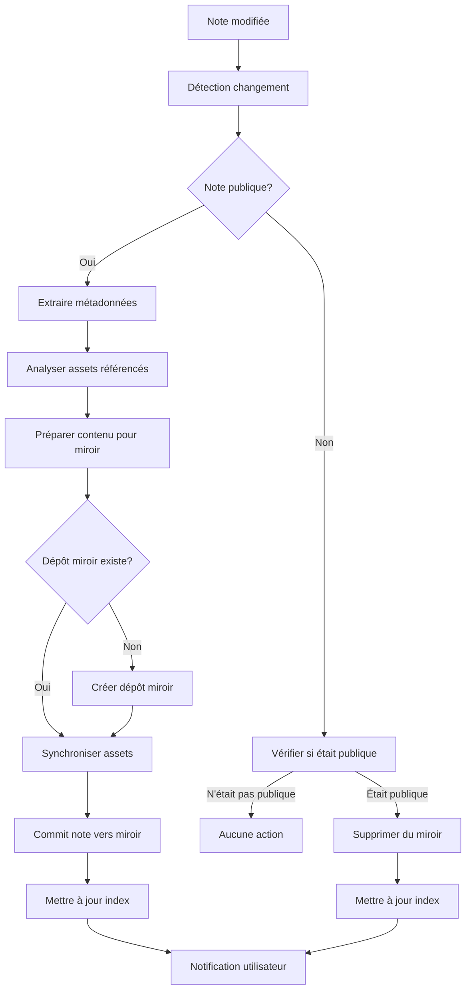

# Plan d'Implémentation - Partage Public de Notes LiteNote

## 🎯 Vision de la Fonctionnalité

Permettre aux utilisateurs de LiteNote de **partager publiquement certaines notes de leurs dépôts privés** sans aucune infrastructure supplémentaire. Cette fonctionnalité utilise un système de "miroir public" intelligent qui synchronise automatiquement les notes marquées comme publiques vers un dépôt GitHub public dédié.

## 🏗️ Architecture Technique

### Composants Principaux

1. **Système de Métadonnées YAML** : Utilise le frontmatter pour marquer les notes publiques
2. **Dépôt Miroir Automatique** : `{username}-litenote-public` créé automatiquement
3. **Service de Synchronisation** : Gestion intelligente des mises à jour
4. **Processeur de Liens** : Transformation des liens inter-notes
5. **Gestionnaire d'Erreurs** : Résolution automatique et manuelle des conflits

### Flux de Fonctionnement



## 📝 Système de Métadonnées

### Format des Métadonnées Publiques

```yaml
---
# Métadonnées de publication
public: true
public_title: "Mon Guide Public"
public_description: "Description visible publiquement"
public_tags: ["guide", "tutorial", "public"]
public_category: "documentation"

# Métadonnées de synchronisation
public_created: "2024-01-15T10:30:00Z"
public_updated: "2024-01-20T14:45:00Z"
public_version: 2

# Options de publication
public_show_backlinks: false
public_allow_comments: true
public_featured: false
---

# Contenu de la note...
```

### Métadonnées Disponibles

| Champ                   | Obligatoire | Description                             | Exemple                      |
| ----------------------- | ----------- | --------------------------------------- | ---------------------------- |
| `public`                | ✅           | Active le partage public                | `true`                       |
| `public_title`          | ❌           | Titre personnalisé pour le public       | `"Mon Guide Complet"`        |
| `public_description`    | ❌           | Description visible publiquement        | `"Un guide détaillé sur..."` |
| `public_tags`           | ❌           | Tags pour organiser vos notes publiques | `["guide", "tutorial"]`      |
| `public_category`       | ❌           | Catégorie de la note                    | `"documentation"`            |
| `public_show_backlinks` | ❌           | Afficher les liens entrants             | `false`                      |
| `public_featured`       | ❌           | Mettre en avant cette note              | `true`                       |

## 🗂️ Structure du Dépôt Miroir Public

```sh
{username}-litenote-public/
├── README.md                    # Page d'accueil générée
├── .litenote-mirror.json       # Configuration du miroir
├── .github/
│   └── workflows/
│       └── pages.yml           # Déploiement GitHub Pages (optionnel)
├── notes/
│   ├── index.md               # Index des notes publiques
│   ├── guides/
│   │   ├── guide-1.md
│   │   └── guide-2.md
│   └── articles/
│       └── article-1.md
├── assets/
│   ├── images/
│   └── files/
└── _data/
    ├── notes-index.json       # Index searchable
    └── tags.json             # Index des tags
```

### Configuration du Miroir (.litenote-mirror.json)

```json
{
  "version": "1.0",
  "source_repo": "username/private-notes",
  "created": "2024-01-15T10:30:00Z",
  "last_sync": "2024-01-20T14:45:00Z",
  "sync_count": 42,
  "settings": {
    "auto_generate_index": true,
    "preserve_folder_structure": true,
    "copy_assets": true,
    "generate_rss": false
  },
  "stats": {
    "total_notes": 15,
    "total_assets": 8,
    "total_tags": 12
  }
}
```

## 🔄 Service de Synchronisation

### Architecture du Service

```typescript
interface MirrorSyncService {
  // Gestion du dépôt miroir
  createMirrorRepo(username: string): Promise<string>
  getMirrorRepoName(username: string): string
  checkMirrorExists(username: string): Promise<boolean>
  
  // Synchronisation des notes
  syncNote(note: PublicNote): Promise<SyncResult>
  syncAllPublicNotes(): Promise<SyncResult[]>
  removeNoteFromMirror(notePath: string): Promise<boolean>
  
  // Gestion des assets
  syncAssets(assets: string[]): Promise<string[]>
  updateAssetReferences(content: string, assetMap: Map<string, string>): string
  
  // Utilitaires
  generateMirrorIndex(): Promise<void>
  updateMirrorConfig(): Promise<void>
}
```

### Flux de Synchronisation



## 🔗 Gestion des Liens Inter-Notes

### Problématique des Liens

Dans LiteNote, les utilisateurs utilisent la syntaxe `[[nom-de-note]]` pour créer des liens entre notes. Quand une note devient publique, ces liens peuvent pointer vers :

1. **Notes publiques** → Doivent être transformés en liens fonctionnels
2. **Notes privées** → Doivent être gérés avec avertissement
3. **Notes inexistantes** → Doivent être préservés comme liens brisés

### Algorithme de Transformation

```mermaid
graph TD
    A[Contenu avec liens [[note]]] --> B[Extraire tous les liens]
    B --> C[Pour chaque lien]
    C --> D{Note existe?}
    D -->|Non| E[Marquer comme lien brisé]
    D -->|Oui| F{Note est publique?}
    F -->|Oui| G[Transformer en lien relatif]
    F -->|Non| H[Transformer en lien désactivé]
    G --> I[Ajouter à la liste des liens publics]
    H --> J[Ajouter à la liste des liens privés]
    E --> K[Ajouter à la liste des liens brisés]
    I --> L[Générer contenu final]
    J --> L
    K --> L
```

### Transformation des Liens

```markdown
<!-- Dans la note privée -->
Voir aussi [[ma-note-privee]] et [[ma-note-publique]]

<!-- Dans la note publique -->
Voir aussi [ma-note-privee](# "Cette note n'est pas publique") et [ma-note-publique](./ma-note-publique.md)
```

## 🎛️ Interface Utilisateur

### Indicateurs Visuels

**Dans la liste des notes** :

- 🌐 Icône pour les notes publiques
- 📝 Icône pour les notes privées
- ⏳ Icône pour les notes en cours de synchronisation

**Dans l'éditeur de note** :

- Badge "PUBLIC" dans l'en-tête
- Lien vers la version publique
- Statut de synchronisation

### Dashboard des Notes Publiques

```vue
<!-- Composant PublicNotesDashboard.vue -->
<template>
  <div class="public-dashboard">
    <div class="dashboard-header">
      <h2>Mes Notes Publiques</h2>
      <div class="mirror-info">
        <span>Dépôt miroir : </span>
        <a :href="mirrorRepoUrl" target="_blank">
          {{ mirrorRepoName }}
        </a>
      </div>
    </div>
    
    <div class="public-notes-list">
      <div 
        v-for="note in publicNotes" 
        :key="note.sha"
        class="public-note-item"
      >
        <div class="note-info">
          <h3>{{ note.metadata.public_title || note.title }}</h3>
          <p>{{ note.metadata.public_description }}</p>
          <div class="note-tags">
            <span 
              v-for="tag in note.metadata.public_tags"
              :key="tag"
              class="tag"
            >
              {{ tag }}
            </span>
          </div>
        </div>
        
        <div class="note-actions">
          <button @click="editNote(note)">Éditer</button>
          <button @click="viewPublic(note)">Voir public</button>
          <button @click="unpublish(note)">Dépublier</button>
        </div>
        
        <div class="sync-status">
          <span :class="getSyncStatusClass(note)">
            {{ getSyncStatusText(note) }}
          </span>
        </div>
      </div>
    </div>
  </div>
</template>
```

## ⚠️ Gestion des Erreurs et Conflits

### Types d'Erreurs

1. **Erreurs de Création du Dépôt Miroir**
   - Nom de dépôt déjà pris → Proposition de noms alternatifs
   - Permissions insuffisantes → Guide pour configurer les permissions GitHub
   - Quota GitHub dépassé → Information sur les limites et solutions

2. **Erreurs de Synchronisation**
   - Conflits de contenu → Résolution automatique ou manuelle
   - Fichiers trop volumineux → Compression ou exclusion automatique
   - Rate limiting GitHub → Queue avec retry automatique

3. **Erreurs de Réseau**
   - Perte de connexion → Mise en queue pour synchronisation ultérieure
   - Timeout API → Retry avec backoff exponentiel
   - Authentification expirée → Refresh automatique du token

### Interface de Résolution des Conflits

```vue
<!-- ConflictResolutionModal.vue -->
<template>
  <div class="conflict-modal" v-if="conflict">
    <div class="modal-content">
      <div class="modal-header">
        <h2>🔄 Conflit de Synchronisation</h2>
        <p>{{ conflict.description }}</p>
      </div>
      
      <div class="conflict-details">
        <div class="version-comparison">
          <div class="version local">
            <h3>Version Locale</h3>
            <div class="content-preview">{{ conflict.localContent }}</div>
          </div>
          
          <div class="version remote">
            <h3>Version Miroir</h3>
            <div class="content-preview">{{ conflict.remoteContent }}</div>
          </div>
        </div>
      </div>
      
      <div class="resolution-actions">
        <button @click="acceptAutoMerge">Accepter la fusion automatique</button>
        <button @click="useLocalVersion">Utiliser la version locale</button>
        <button @click="useRemoteVersion">Utiliser la version du miroir</button>
        <button @click="editManually">Éditer manuellement</button>
        <button @click="skipSync">Ignorer cette synchronisation</button>
      </div>
    </div>
  </div>
</template>
```

## 🌐 URLs Publiques

Vos notes publiques sont accessibles via :

```md
Format principal :
https://litenote.space/{username}/{username}-litenote-public

Note spécifique :
https://litenote.space/{username}/{username}-litenote-public?note=notes/ma-note.md

Avec GitHub Pages (optionnel) :
https://{username}.github.io/{username}-litenote-public/
```

## 🔒 Sécurité et Confidentialité

### Ce qui est Partagé

- ✅ **Contenu des notes** marquées `public: true`
- ✅ **Assets référencés** (images, fichiers) dans ces notes
- ✅ **Métadonnées publiques** définies par vous

### Ce qui Reste Privé

- ❌ **Toutes les autres notes** de votre dépôt privé
- ❌ **Historique des commits** du dépôt privé
- ❌ **Métadonnées privées** (dates de création, etc.)
- ❌ **Structure complète** de votre dépôt privé

## 🚀 Plan d'Implémentation

### Phase 1 : Fondations (2-3 semaines)

#### 1.1 Système de Détection des Métadonnées

- [ ] Parser de frontmatter YAML
- [ ] Interface `PublicNoteMetadata`
- [ ] Détecteur de changements de statut public

#### 1.2 Service de Base du Dépôt Miroir

- [ ] Création automatique du dépôt miroir
- [ ] Vérification d'existence
- [ ] Configuration initiale

#### 1.3 Synchronisation Basique

- [ ] Commit de notes vers le miroir
- [ ] Suppression de notes du miroir
- [ ] Mise à jour des métadonnées du miroir

### Phase 2 : Fonctionnalités Avancées (2-3 semaines)

#### 2.1 Processeur de Liens Intelligent

- [ ] Détection des liens `[[note]]`
- [ ] Transformation des liens publics
- [ ] Gestion des liens privés et brisés
- [ ] Interface d'avertissement des liens

#### 2.2 Interface Utilisateur Complète

- [ ] Dashboard des notes publiques
- [ ] Indicateurs visuels dans l'interface
- [ ] Composant de gestion des métadonnées publiques
- [ ] Aperçu des notes publiques

#### 2.3 Gestion des Assets

- [ ] Détection des assets référencés
- [ ] Copie vers le dépôt miroir
- [ ] Mise à jour des références

### Phase 3 : Robustesse et Optimisation (1-2 semaines)

#### 3.1 Gestion des Erreurs

- [ ] Gestionnaire d'erreurs complet
- [ ] Interface de résolution des conflits
- [ ] Queue de synchronisation avec retry
- [ ] Notifications utilisateur

#### 3.2 Performance et Cache

- [ ] Optimisation des requêtes GitHub
- [ ] Cache des métadonnées publiques
- [ ] Synchronisation incrémentale

#### 3.3 Documentation et Tests

- [ ] Documentation utilisateur complète
- [ ] Tests unitaires et d'intégration
- [ ] Guide de migration

## 📊 Fichiers à Créer/Modifier

### Nouveaux Fichiers

```sh
src/modules/public-sharing/
├── interfaces/
│   ├── PublicNoteMetadata.ts
│   ├── MirrorConfig.ts
│   └── SyncResult.ts
├── services/
│   ├── MirrorSyncService.ts
│   ├── FrontmatterParser.ts
│   ├── LinkProcessor.ts
│   └── ErrorHandler.ts
├── hooks/
│   ├── usePublicNoteSync.ts
│   ├── usePublicNotes.ts
│   └── useMirrorRepo.ts
├── components/
│   ├── PublicNotesDashboard.vue
│   ├── PublicNoteManager.vue
│   ├── LinkWarningsPanel.vue
│   ├── ConflictResolutionModal.vue
│   └── SyncStatusNotification.vue
└── store/
    └── publicNotes.store.ts
```

### Fichiers à Modifier

```sh
src/hooks/useGitHubContent.hook.ts    # Intégration sync publique
src/hooks/useFile.hook.ts             # Détection métadonnées
src/components/FluxNote.vue           # Indicateurs visuels
src/router/router.ts                  # Nouvelles routes
src/views/ShareNotes.vue              # Amélioration partage
```

## 🎯 Critères de Succès

### Fonctionnels

- [ ] Une note avec `public: true` est automatiquement synchronisée
- [ ] Le dépôt miroir est créé automatiquement
- [ ] Les liens inter-notes sont correctement transformés
- [ ] L'interface utilisateur est intuitive et informative
- [ ] Les erreurs sont gérées gracieusement

### Non-Fonctionnels

- [ ] Synchronisation en moins de 5 secondes pour une note standard
- [ ] Interface réactive et sans blocage
- [ ] Gestion robuste des pannes réseau
- [ ] Sécurité : aucune fuite de données privées

### Expérience Utilisateur

- [ ] Workflow simple : ajouter `public: true` suffit
- [ ] Feedback visuel clair sur le statut de synchronisation
- [ ] Résolution guidée des conflits
- [ ] Documentation claire et accessible

## 🔮 Évolutions Futures

### Fonctionnalités Avancées

- **Intégrations tierces** : RSS, SEO, analytics
- **Fonctionnalités sociales** : Commentaires, likes, partages
- **Thèmes personnalisés** : Apparence des notes publiques
- **Collaboration** : Co-édition de notes publiques

### Optimisations Techniques

- **CDN pour assets** : Performance améliorée
- **Indexation full-text** : Recherche dans les notes publiques
- **API publique** : Accès programmatique aux notes
- **Webhooks** : Notifications de changements

---

## 📋 Checklist de Validation

### Avant Implémentation

- [ ] Architecture validée par l'équipe
- [ ] Spécifications techniques approuvées
- [ ] Maquettes UI/UX validées
- [ ] Plan de tests défini

### Pendant l'Implémentation

- [ ] Tests unitaires pour chaque composant
- [ ] Tests d'intégration avec GitHub API
- [ ] Validation de sécurité
- [ ] Tests de performance

### Avant Déploiement

- [ ] Tests utilisateur avec groupe pilote
- [ ] Documentation utilisateur complète
- [ ] Plan de rollback défini
- [ ] Monitoring et alertes configurés

---

*Ce plan constitue la feuille de route complète pour l'implémentation de la fonctionnalité de partage public de LiteNote. Il peut être adapté selon les priorités et contraintes du projet.*
